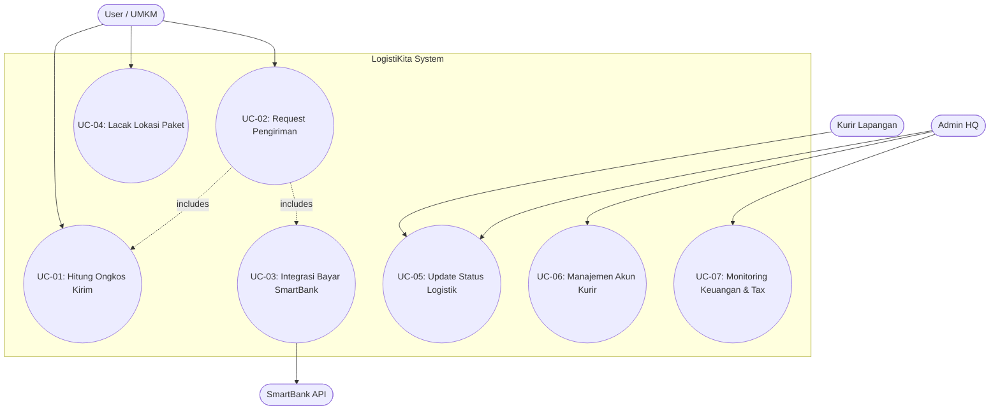
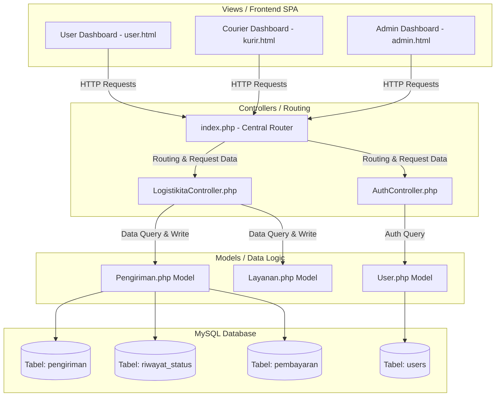
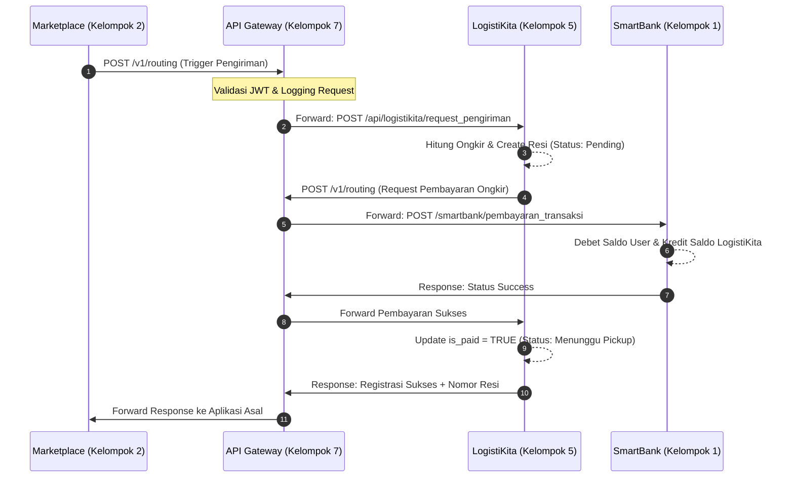

# DOKUMEN DESAIN REKAYASA PERANGKAT LUNAK (RPL): LOGISTIKITA (KELOMPOK 5)

---

# Panduan Ekspor Diagram ke Microsoft Word
> [!IMPORTANT]
> Karena kode diagram di bawah ini ditulis dalam format **Mermaid Syntax** (berbasis teks), diagram tidak akan langsung muncul jika Anda langsung menyalin (*copy-paste*) kode teks tersebut ke Microsoft Word.
> 
> **Cara Mengubah Diagram Menjadi Gambar untuk Laporan Word Anda:**
> 1.  **Menggunakan Mermaid Live Editor (Rekomendasi Utama - Hasil Gambar HD):**
>     *   Salin (*copy*) blok kode teks diagram di bawah ini (hanya bagian di dalam tanda triple backtick ` ```mermaid ` hingga ` ``` `).
>     *   Buka peramban (*browser*) dan kunjungi situs gratis: [mermaid.live](https://mermaid.live).
>     *   Tempelkan (*paste*) kode tersebut ke dalam kolom **Code** di sebelah kiri.
>     *   Diagram akan otomatis ter-render secara visual menjadi gambar resolusi tinggi di sebelah kanan.
>     *   Klik tombol **Actions** di panel bawah kanan, lalu klik **Download PNG** atau **Download SVG**.
>     *   Masukkan (*Insert Image*) file gambar hasil unduhan tersebut ke Microsoft Word Anda.
> 2.  **Menggunakan Snipping Tool / Screenshot:**
>     *   Buka dokumen markdown ini menggunakan penampil markdown (misal *VS Code Markdown Preview* atau ekstensi penampil markdown di Chrome).
>     *   Setelah diagram tampil secara visual di layar komputer Anda, tekan tombol shortcut **Windows + Shift + S** (pada Windows).
>     *   Seleksi area gambar diagram di layar Anda.
>     *   Buka dokumen Microsoft Word, lalu tekan **Ctrl + V** untuk menempelkan (*paste*) gambar secara instan.

---

# 1. Deskripsi Aplikasi

## Deskripsi Aplikasi
**LogistiKita** merupakan sebuah Sistem Informasi Manajemen Ekspedisi dan Distribusi Logistik berbasis *web* yang dibangun sebagai solusi komprehensif untuk mendigitalkan proses pemindahan barang secara fisik. Dalam lanskap industri digital, perdagangan elektronik (*e-commerce*) tidak akan pernah terwujud tanpa adanya tulang punggung distribusi yang solid. LogistiKita hadir untuk mengisi ruang tersebut, bertindak sebagai mesin penggerak (*engine*) yang mengubah kesepakatan jual-beli di dunia maya menjadi serangkaian aksi pemindahan barang yang dapat diukur, dilacak, dan divalidasi di dunia nyata. Aplikasi ini didesain menggunakan paradigma arsitektur *Model-View-Controller* (MVC) yang memisahkan logika bisnis (*backend*), manajemen basis data, dan antarmuka pengguna (*frontend*) secara tegas. Pemisahan ini memastikan bahwa sistem mampu memproses ratusan hingga ribuan permintaan pengiriman secara serentak tanpa mengalami penurunan performa yang berarti.

Dari perspektif teknis dan operasional, LogistiKita bekerja dengan prinsip *data-driven logistics*. Proses bisnis aplikasi ini dimulai secara otomatis ketika *server* menerima sekumpulan data mentah yang diinjeksi oleh aplikasi pihak ketiga (seperti *Marketplace*). Data mentah ini memuat informasi krusial berupa identitas pengirim, alamat asal, alamat tujuan akhir, spesifikasi dimensi/berat barang, serta jenis layanan yang dipilih. Mesin komputasi LogistiKita kemudian akan memproses data tersebut untuk menerbitkan sebuah nomor resi identifikasi (*tracking number*) yang unik. Setelah pesanan tervalidasi, sistem akan mendaftarkan paket tersebut ke dalam antrean *dispatch* internal, lalu menyebarkan penugasan tersebut kepada armada kurir yang terdeteksi sedang berstatus *standby* di lapangan.

Selain manajemen penugasan, keunggulan utama dari deskripsi operasional aplikasi ini adalah kemampuannya dalam mencatat rekam jejak (*audit trail*). Seluruh siklus hidup sebuah paket—mulai dari titik penjemputan awal di gudang penjual, proses transit antar zona, hingga detik di mana paket diserahkan ke tangan pembeli—akan direkam secara presisi ke dalam basis data. Sistem pencatatan riwayat yang persisten ini tidak hanya berfungsi sebagai bentuk transparansi bagi konsumen, tetapi juga menjadi instrumen pelaporan yang valid bagi manajemen perusahaan logistik untuk mengevaluasi kecepatan dan efisiensi armada mereka di lapangan.

## Tujuan Aplikasi
Pengembangan aplikasi perangkat lunak LogistiKita dilandasi oleh urgensi untuk menyelesaikan berbagai hambatan operasional yang kerap terjadi dalam sistem distribusi konvensional. Secara garis besar, aplikasi ini dikembangkan dengan tiga tujuan utama yang saling berkaitan erat:

**a. Otomatisasi Kalkulasi Tarif Logistik secara Akurat**
Pada sistem distribusi tradisional, penentuan harga ongkos kirim seringkali bersifat buram atau melibatkan proses negosiasi yang memakan waktu. Tujuan utama dari aplikasi LogistiKita adalah mengeliminasi bias tersebut dengan menyediakan modul kalkulator tarif algoritmik. Sistem ini dirancang untuk menghitung biaya secara otomatis pada hitungan milidetik (*real-time*) dengan menjumlahkan tarif dasar, mengalikannya dengan berat barang (dalam hitungan kilogram), serta menyesuaikannya dengan premi jenis layanan (*Reguler* vs *Express*). Hal ini memastikan bahwa setiap pelanggan dalam ekosistem mendapatkan harga yang seragam, adil, dan transparan tanpa ada biaya tersembunyi.

**b. Menciptakan Ekosistem Pelacakan Terpadu (Real-Time Tracking)**
Kecemasan konsumen terhadap lokasi barang kiriman mereka adalah salah satu isu terbesar dalam bisnis ekspedisi. Tujuan sistem LogistiKita adalah menyediakan antarmuka pelacakan visual yang memungkinkan pengguna melihat pergerakan barang mereka dari menit ke menit. Sistem ini membebaskan kurir dari keharusan menelepon pusat kendali; kurir cukup menekan satu tombol pembaruan status di aplikasi gawai mereka, dan *server* LogistiKita akan seketika itu juga memancarkan status terbaru tersebut kepada *database*, yang kemudian akan direfleksikan ke layar pelanggan yang sedang melacak nomor resi tersebut.

**c. Mengeksekusi Penagihan Lintas-Aplikasi (Cross-System Billing)**
Tujuan pamungkas dari aplikasi ini adalah untuk mencapai kematangan integrasi dengan pusat keuangan digital. LogistiKita ditargetkan untuk tidak berdiri sendiri, melainkan secara aktif berkomunikasi dengan server perbankan (*SmartBank*) melalui protokol API. Tujuannya adalah agar proses pembayaran ongkos kirim dapat ditarik secara elektronik tanpa campur tangan manusia. Sistem hanya akan melepaskan surat jalan kepada kurir lapangan jika dan hanya jika server bank memberikan kode respons konfirmasi bahwa uang pelanggan telah sukses didebit. Ini menjamin nol risiko gagal bayar bagi perusahaan logistik.

## Peran dalam Ekosistem
Dalam simulasi ekosistem Rekayasa Perangkat Lunak (RPL) yang menggabungkan entitas *Marketplace*, *SupplierHub*, *POS*, dan perbankan, LogistiKita bukan sekadar fitur pelengkap. LogistiKita memegang peran makro-ekonomi yang sangat absolut sebagai **Penyelesai Rantai Pasok Fisik (Physical Supply Chain Resolver)** dan **Penggerak Biaya (Cost Driver)**.

Sebagai Penyelesai Rantai Pasok, peran LogistiKita adalah menjadi eksekutor dunia nyata. Aplikasi e-commerce di dalam ekosistem ini pada dasarnya hanyalah penyedia etalase katalog dan pencatat perpindahan kepemilikan. Transaksi jual-beli puluhan juta rupiah di sebuah *Marketplace* tidak akan pernah memiliki nilai nyata apabila barang fisiknya tidak pernah diantarkan ke rumah konsumen. Kehadiran LogistiKita menjamin bahwa siklus transaksi tersebut ditutup dengan serah terima fisik. LogistiKita adalah kaki dan tangan dari keseluruhan ekosistem perdagangan ini.

Dari sudut pandang regulasi ekonomi, peran LogistiKita justru jauh lebih krusial, yakni sebagai *Cost Driver* (Pemicu Biaya) yang memegang peranan *Money Sink* (Penyerap Inflasi). Di dalam simulasi ekonomi digital, uang dapat berpindah dengan sangat cepat dan terakumulasi di pihak penjual. Untuk meniru ekonomi dunia nyata, setiap transaksi harus dikenakan ongkos operasional. LogistiKita akan menarik ongkos kirim dari pembeli, namun LogistiKita diwajibkan oleh aturan sistem untuk memotong **5% dari pendapatannya** untuk dibuang/disetorkan ke perbendaharaan *SmartBank* sebagai pajak layanan infrastruktur. Potongan 5% yang terus-menerus terjadi di setiap pergerakan paket ini secara perlahan akan menyedot uang keluar dari peredaran warga ekosistem, sehingga mencegah terjadinya suplai uang berlebih (*hyperinflation*) dan menjaga agar simulasi ekonomi tetap stabil dan masuk akal.

## Stakeholder
Untuk menjalankan siklus distribusinya secara utuh, sistem LogistiKita melibatkan partisipasi dari empat entitas atau pemangku kepentingan (*Stakeholder*) yang memiliki wewenang, antarmuka pengguna (*User Interface*), serta proses bisnis yang terpisah:

**1. Aktor: User (Pengirim / Pelanggan / UMKM)**
Ini adalah kelompok aktor eksternal yang jumlahnya paling masif dalam sistem. Mereka adalah pihak yang memicu hidup matinya bisnis logistik. Kepentingan utama User saat mengakses aplikasi adalah kepraktisan: mereka ingin memasukkan alamat tujuan, melihat harga yang muncul secara instan, menyetujui pemotongan saldo *SmartBank*, dan mendapatkan nomor resi yang bisa langsung dicek. Kepuasan entitas ini bergantung sepenuhnya pada akurasi dan kecepatan pembaruan status barang.

**2. Aktor: Kurir (Armada Eksekutor Lapangan)**
Ini adalah kelompok pekerja operasional yang bergerak secara dinamis. Mereka tidak mengurus transaksi uang secara langsung, melainkan fokus pada eksekusi fisik. Melalui *Dashboard Kurir*, sistem memberikan mereka daftar tugas harian (*dispatch list*) yang rapi dan terurut berdasarkan status "Menunggu Penjemputan". Motivasi utama entitas ini adalah menyelesaikan sebanyak mungkin tugas pengantaran hingga berstatus "Delivered", karena dari sanalah *server* akan merekam produktivitas mereka dan menghitung nilai komisi atau upah kerja harian yang berhak mereka cairkan ke rekening pribadi mereka nantinya.

**3. Aktor: Admin (Pusat Pengendali / LogistiKita HQ)**
Ini adalah aktor internal yang bertindak bagaikan jenderal di ruang komando. Berbeda dengan Kurir yang melihat secara parsial, Admin memiliki pandangan dewa (*god-eye view*) terhadap keseluruhan sistem. Wewenang Admin sangat luas, mulai dari memvalidasi pesanan yang anomali, mendaftarkan armada kurir baru ke dalam basis data `users`, memantau pergerakan grafik pendapatan operasional, hingga mengawasi konsol log gerbang API (*API Gateway Console*) untuk mendeteksi apabila terjadi serangan siber atau kegagalan pertukaran data (*timeout*) antara server logistik dengan server *Marketplace* maupun *SmartBank*. Admin bertugas memastikan perusahaan tetap beroperasi dan untung.

**4. Aktor: SmartBank (Otoritas Lintas-Sistem)**
Meskipun secara teknis merupakan aplikasi eksternal (dikelola oleh kelompok mahasiswa yang berbeda), SmartBank adalah pemegang kebijakan mutlak (*stakeholder* absolut) bagi LogistiKita. LogistiKita tidak memiliki kuasa untuk memegang saldo pengguna secara mandiri. Oleh karena itu, LogistiKita berstatus sangat bergantung (*highly dependent*) kepada *SmartBank*. Jika API *SmartBank* menolak transaksi karena pelanggan kehabisan uang, LogistiKita secara sepihak diwajibkan untuk menghentikan seluruh proses *pickup* paket tersebut. Hubungan simbiosis ini adalah contoh nyata penerapan prinsip *Stateless Finance* pada arsitektur sistem informasi modern.

## Menentukan Konteks Sistem
Mengingat kompleksitas integrasi antar berbagai kelompok dalam tugas besar ini, sangat krusial untuk menentukan batas-batas wilayah operasional aplikasi agar tidak terjadi duplikasi fitur atau tumpang tindih logika pemrograman (*logic overlap*). Oleh karena itu, pengembangan aplikasi LogistiKita dipagari oleh beberapa konteks dan batasan sistem (*scope boundaries*) yang sangat tegas.

Konteks pembatas pertama adalah **Prinsip Aplikasi Bersifat Pasif (Triggered-Based Operation)**. LogistiKita dilarang keras menciptakan pesanan fiktif secara mandiri tanpa adanya dasar transaksi yang jelas. Aplikasi ini akan terus berada dalam status pasif (*idle*) dan baru akan memunculkan faktur tagihan logistik apabila ia menerima tembakan *trigger* (berupa pengiriman data `order_id` dan detail `alamat`) dari sistem perdagangan pihak ketiga seperti aplikasi *Marketplace* atau *SupplierHub*.

Konteks pembatas kedua adalah **Prinsip Ketidakmampuan Finansial Langsung (Stateless Finance)**. LogistiKita tidak didesain untuk menjadi sebuah aplikasi dompet digital atau perbankan elektronik. Oleh karena itu, batasan sistem melarang LogistiKita untuk menyimpan catatan saldo (*balance*) pelanggan di dalam basis datanya sendiri. Aplikasi logistik ini tidak menyediakan fitur pengisian ulang dana (*top-up*) maupun penarikan dana tunai (*withdraw*). Segala macam proses pemotongan uang pelanggan mutlak dilakukan dengan cara mengirimkan *request* pemotongan uang (misalnya melalui *endpoint API* POST `/logistics/pay`) kepada basis data server SmartBank. Data keuangan yang tersimpan di dalam basis data LogistiKita (seperti tabel pembayaran) hanyalah sekadar cermin atau rekam jejak (*log*) historis dari transaksi yang telah disahkan secara eksternal oleh sistem pihak bank.

---

# 2. Use Case / Fitur Utama

Bagian ini mengidentifikasi kebutuhan fungsional sistem LogistiKita berdasarkan skema ekosistem ekonomi digital terintegrasi. Fitur-fitur utama di bawah ini dirancang untuk mendefinisikan interaksi antara aktor manusia (User, Kurir, Admin) serta interaksi otomatis antar-sistem (Machine-to-Machine API).

## 2.1 Use Case Diagram (Visualisasi Fungsional)
Diagram Use Case di bawah menggambarkan pemisahan aktor dan hubungannya dengan masing-masing kasus penggunaan (*use case*) di dalam batasan sistem LogistiKita:



## 2.2 Deskripsi Detail Use Case Utama

### 2.2.1 Use Case Specification: Request Pengiriman (UC-02)
*   **Aktor Utama:** User (Pengirim / UMKM), SmartBank API (Aktor Pendukung)
*   **Deskripsi Singkat:** Proses pembuatan order ekspedisi fisik baru yang dipicu oleh transaksi sukses pihak ketiga, diikuti penarikan dana otomatis via bank.
*   **Pre-Kondisi:** User telah menyelesaikan checkout di Marketplace, mendapatkan `order_id`, dan memiliki saldo di SmartBank yang cukup untuk membayar ongkos kirim.
*   **Post-Kondisi:** Transaksi pengiriman terbuat di database LogistiKita dengan parameter `is_paid = TRUE` dan status awal `menunggu_pickup` diterbitkan.
*   **Alur Utama (Main Flow):**
    1.  Sistem mendeteksi trigger JSON pengiriman dari eksternal.
    2.  Sistem melakukan *UC-01: Hitung Ongkos Kirim* berdasarkan parameter input berat dan jarak.
    3.  Sistem mengirimkan invoice tagihan (*payment request*) ke API SmartBank.
    4.  Sistem menerima status "Sukses" dari SmartBank.
    5.  Sistem menyimpan data pemesanan ke database `pengiriman`, mengubah flag pembayaran `is_paid = 1`, serta merilis nomor resi.

### 2.2.2 Use Case Specification: Update Status Logistik (UC-05)
*   **Aktor Utama:** Kurir Lapangan, Admin HQ
*   **Deskripsi Singkat:** Mengubah parameter status perpindahan fisik paket dan mencatat histori log pelacakan barang.
*   **Pre-Kondisi:** Paket telah terdaftar di database dengan status minimal `menunggu_pickup` dan pembayaran lunas.
*   **Post-Kondisi:** Status paket diperbarui dan terekam di tabel riwayat log checkpoint (`riwayat_status`) untuk pelacakan.
*   **Alur Utama (Main Flow):**
    1.  Aktor (Kurir/Admin) memasukkan nomor resi paket.
    2.  Sistem menampilkan status paket saat ini.
    3.  Aktor memilih status pergerakan baru (misalnya mengubah dari `pickup` menjadi `transit`).
    4.  Sistem memperbarui kolom `status` di tabel `pengiriman`.
    5.  Sistem menulis baris log baru ke tabel `riwayat_status` mencantumkan waktu update, checkpoint lokasi, dan keterangan.

---

## 2.3 Daftar Fitur Utama
*   **Fitur 1: Request Pengiriman (`/logistikita/request_pengiriman`):** Menerima data kiriman, menerbitkan nomor resi unik, dan meregistrasikan pengiriman baru ke database logistik.
*   **Fitur 2: Tracking Status (`/logistikita/tracking_status`):** Menampilkan linimasa pelacakan pergerakan paket secara *real-time* kepada pelanggan dan memfasilitasi pembaruan checkpoint oleh kurir.
*   **Fitur 3: Biaya Pengiriman (`/logistikita/biaya_pengiriman`):** Kalkulator otomatis tarif pengiriman berdasarkan variabel bobot fisik paket dan jarak jangkauan.
*   **Fitur 4: Pembayaran Logistik (`/logistikita/pembayaran_logistik`):** Integrasi tagihan logistik ke SmartBank untuk menarik pembayaran ongkir digital secara otomatis.
*   **Fitur 5: Biaya Layanan Logistik (`/logistikita/biaya_layanan_logistik`):** Modul akuntansi yang memotong biaya layanan logistik sebesar 5% dari setiap pengiriman terbayar untuk disetorkan sebagai pajak ekosistem.

---

# 3. Diagram Arsitektur

Arsitektur aplikasi LogistiKita dibangun dengan mematuhi pola desain **Model-View-Controller (MVC) Native** yang terintegrasi secara *stateless* melalui *API Gateway / Integrator* menuju entitas luar (SmartBank, Marketplace, SupplierHub).

## 3.1 Blok Arsitektur Internal MVC

Pola komunikasi internal sistem LogistiKita dijabarkan dalam diagram blok berikut:



### Penjelasan Rinci Aliran Data Arsitektur MVC Internal
Blok arsitektur di atas menggambarkan bagaimana LogistiKita memisahkan tanggung jawab sistem menjadi empat lapisan modular utama guna menjaga kode tetap rapi (*clean code*) dan terhindar dari *spaghetti code*:

1.  **View Layer (Frontend SPA - user.html, kurir.html, admin.html):**
    Lapisan ini beroperasi sepenuhnya pada browser pengguna. Dibangun menggunakan konsep *Single Page Application* (SPA) berbasis Vanilla HTML, CSS, dan JavaScript. JavaScript di sini bertindak sebagai orkestrator yang menangkap interaksi pengguna (misal penekanan tombol update status oleh kurir), lalu mengirimkan permintaan asinkronus menggunakan perintah `fetch()` HTTP Request ke server backend. Dengan demikian, halaman tidak perlu dimuat ulang (*refresh*), memberikan kinerja UI yang mulus dan modern.
2.  **Controller Layer (index.php, LogistikitaController.php, AuthController.php):**
    *   **index.php (Central Router):** Bertindak sebagai *Front Controller* atau gerbang masuk tunggal untuk semua permintaan masuk. Ia menganalisis parameter URL (misalnya `request=api/logistikita/request_pengiriman`) dan mengarahkannya ke Controller yang sesuai.
    *   **LogistikitaController.php:** Berisi logika pengendali utama aplikasi logistik. Tugasnya adalah menerima input dari View (seperti parameter berat, alamat, resi), melakukan validasi format data, memanggil fungsi komputasi pada Model, dan menyusun format Response dalam bentuk JSON standard.
    *   **AuthController.php:** Pengendali khusus yang menangani proses otentikasi pengguna, otorisasi peran (*role verification*), manajemen sesi masuk (*session management*), dan keluar (*logout*) dari sistem.
3.  **Model Layer (Pengiriman.php, User.php, Layanan.php):**
    Model bertindak sebagai representasi data dan rumah bagi logika bisnis utama. Di dalam PHP Native, Model berinteraksi langsung dengan database dengan mengeksekusi perintah SQL (seperti *INSERT*, *SELECT*, *UPDATE*).
    *   `Pengiriman.php` mengelola data paket, penghitungan ongkir, dan pencatatan riwayat status paket.
    *   `User.php` bertugas membaca dan memanipulasi data pengguna (Admin, Kurir, Pelanggan) dari database.
    *   `Layanan.php` menyimpan parameter konfigurasi tarif dasar ekspedisi.
4.  **Database Layer (MySQL Database):**
    Lapisan persistensi data fisik yang menyimpan semua informasi secara aman dalam tabel relasional. Perubahan status di database (misal update tabel `pengiriman` ke `is_paid = 1`) akan langsung tercermin seketika itu juga pada dashboard Admin dan linimasa pelacakan User pada hitungan milidetik berikutnya.

---

## 3.2 Diagram Integrasi Lintas-Sistem Ekosistem RPL

Diagram ini menunjukkan bagaimana LogistiKita berinteraksi dengan aplikasi kelompok lain melalui API Gateway:



### Penjelasan Rinci Alur Sequence Integrasi Lintas-Sistem
Diagram alur urutan (*Sequence Diagram*) di atas memaparkan rantai transaksi logistik-finansial otomatis antar-kelompok di dalam ekosistem terpadu dari awal hingga akhir transaksi selesai:

1.  **Langkah 1 (Trigger Transaksi):** Pihak *Marketplace* atau *SupplierHub* mengirimkan permintaan routing pengiriman (`POST /v1/routing`) ke *API Gateway* setelah pembeli menyelesaikan checkout barang. Paket request membawa data detail alamat pengiriman dan dimensi barang.
2.  **Langkah 2 (Middleware Gateway):** *API Gateway* menerima request tersebut, melakukan validasi tanda tangan JWT (*JSON Web Token*) untuk keamanan, mencatat aktivitas log ke sistem monitor gateway, lalu meneruskan request tersebut ke server *LogistiKita*.
3.  **Langkah 3 (Forward Request):** *API Gateway* melakukan *forward* request ke endpoint internal LogistiKita: `POST /api/logistikita/request_pengiriman`.
4.  **Langkah 4 (Komputasi Internal LogistiKita):** Server *LogistiKita* secara internal memanggil modul kalkulator ongkir dinamis untuk menghitung tarif pengapalan. Sistem secara bersamaan menerbitkan kode pelacakan unik (*nomor resi*) baru, menyimpan order tersebut ke tabel database dengan status `pending` (belum terbayar) karena paket belum sah secara finansial.
5.  **Langkah 5 (Permintaan Pembayaran):** *LogistiKita* mengirimkan tagihan ongkir balik ke *API Gateway* untuk meminta verifikasi dan eksekusi debit dana dari rekening *SmartBank* milik pembeli.
6.  **Langkah 6 (Forward Payment Request):** *API Gateway* meneruskan data tagihan tersebut ke endpoint bank pusat: `POST /smartbank/pembayaran_transaksi`.
7.  **Langkah 7 (Debet & Kredit Saldo Bank):** Server pusat *SmartBank* secara mutlak memeriksa kelayakan rekening pembeli. Jika saldo memadai, bank mendebet (memotong) saldo pembeli dan mengkreditkan (menambah) saldo tersebut ke rekening penampungan LogistiKita. Di sini, bank juga dapat memotong pajak/fee ekosistem.
8.  **Langkah 8 (Konfirmasi Sukses Bank):** *SmartBank* mengirimkan response status transaksi sukses (HTTP 200) ke *API Gateway*.
9.  **Langkah 9 (Forward Konfirmasi):** *API Gateway* mengoperasikan status sukses pembayaran tersebut kembali ke server *LogistiKita*.
10. **Langkah 10 (Mutasi State Logistik):** Menerima jaminan pembayaran valid dari bank, *LogistiKita* memicu query MySQL untuk mengupdate flag pembayaran `is_paid = TRUE` dan menaikkan status pengiriman dari `pending` ke `menunggu_pickup`. Hal ini juga memicu penulisan riwayat status pertama di database log.
11. **Langkah 11 (Response Sukses Akhir):** *LogistiKita* mengirimkan response sukses registrasi logistik beserta nomor resi yang aktif ke *API Gateway*.
12. **Langkah 12 (Resolusi ke Pembeli):** *API Gateway* menyampaikan data resi tersebut kembali ke sistem asal (*Marketplace*), yang kemudian menampilkannya pada layar pembeli sebagai tanda bahwa pesanan fisik mereka telah siap dijemput oleh kurir LogistiKita.

---


# 4. Flow Proses (Input - Proses - Output)

Di bawah ini adalah penjelasan terperinci mengenai alur logika sistem (IPO) untuk masing-masing dari lima fitur utama LogistiKita:

### 4.1 IPO Fitur 1: Request Pengiriman
*   **Input:**
    *   `user_id` (Integer - ID pengirim barang)
    *   `penerima_nama` (String - Nama lengkap penerima)
    *   `penerima_telp` (String - Kontak penerima)
    *   `penerima_alamat` (Text - Alamat lengkap tujuan)
    *   `berat` (Float - Berat paket dalam satuan kg)
    *   `layanan` (String - Pilihan tipe layanan: "Reguler" / "Express")
    *   `biaya_ongkir` (Decimal - Ongkos kirim yang telah dihitung)
*   **Proses:**
    1.  Controller menangkap request POST dan melakukan validasi kelengkapan parameter input.
    2.  Model memicu fungsi generator alfanumerik untuk membuat nomor resi unik (contoh format: `LKT-[RANDOM_STRING]`).
    3.  Menyimpan entitas transaksi ke dalam tabel `pengiriman` dengan parameter `is_paid = FALSE` dan `status = 'pending'`.
*   **Output:**
    *   Objek JSON: `status: 'success'`, `message: 'Request pengiriman berhasil dibuat'`, dan payload data `resi` beserta rincian pengiriman.

### 4.2 IPO Fitur 2: Tracking Status
*   **Input:**
    *   `resi` (String - Nomor resi paket)
    *   `status` (String - Status baru: `menunggu_pickup` / `pickup` / `transit` / `delivery` / `delivered`)
    *   `lokasi` (String - Posisi checkpoint kurir, misal: "Admin HQ" atau "Kurir Hub Cawang")
    *   `keterangan` (String - Informasi tambahan, misal: "Kurir sedang menuju alamat penerima")
*   **Proses:**
    1.  Sistem melakukan pencarian data berdasarkan parameter `resi` di tabel `pengiriman`.
    2.  Jika ditemukan, sistem memperbarui nilai kolom `status` di tabel `pengiriman` sesuai input baru.
    3.  Sistem merekam entri log baru ke dalam tabel `riwayat_status` (mencatat `pengiriman_id`, `status`, `lokasi`, `keterangan`, dan stempel waktu `waktu_update`).
*   **Output:**
    *   Objek JSON: `status: 'success'`, `message: 'Status pengiriman berhasil diupdate'`.

### 4.3 IPO Fitur 3: Biaya Pengiriman
*   **Input:**
    *   `asal` (String - Alamat/Kota pengirim)
    *   `tujuan` (String - Alamat/Kota penerima)
    *   `berat` (Float - Bobot paket dalam kg)
    *   `layanan` (String - Jenis layanan ekspedisi)
    *   `asuransi` (Boolean - Pilihan asuransi tambahan)
    *   `nilai_barang` (Decimal - Nilai barang jika mengaktifkan asuransi)
*   **Proses:**
    1.  Sistem mengambil tarif dasar ekspedisi logistik (contoh: Rp 10.000 untuk Reguler, Rp 15.000 untuk Express).
    2.  Sistem mengalikan tarif dasar tersebut dengan pembulatan ke atas dari berat barang (`ceil(berat)`).
    3.  Jika parameter `asuransi` bernilai `true`, sistem menambahkan biaya premi sebesar 0.5% dari parameter `nilai_barang`.
    4.  Menghitung akumulasi akhir biaya logistik.
*   **Output:**
    *   Objek JSON berisi rincian: `asal`, `tujuan`, `berat`, `biaya_ongkir`, `asuransi`, dan `total_biaya`.

### 4.4 IPO Fitur 4: Pembayaran Logistik
*   **Input:**
    *   `pengiriman_id` (Integer - ID baris tabel pengiriman)
    *   `bank_ref` (String - Nomor referensi transaksi dari SmartBank)
    *   `amount` (Decimal - Jumlah uang yang sukses didebit)
*   **Proses:**
    1.  Menerima callback/notifikasi sukses dari gerbang SmartBank atas transaksi tagihan ongkir.
    2.  Sistem memperbarui kolom `is_paid = TRUE` dan mengubah `status` paket menjadi `menunggu_pickup` pada tabel `pengiriman`.
    3.  Memasukkan catatan transaksi sukses ke tabel `pembayaran` sebagai bukti rekonsiliasi keuangan.
    4.  Memicu catatan sejarah log awal ke tabel `riwayat_status` dengan keterangan "Pembayaran terkonfirmasi via SmartBank".
*   **Output:**
    *   Objek JSON: `status: 'success'`, `message: 'Status pembayaran dan pengiriman berhasil diperbarui'`.

### 4.5 IPO Fitur 5: Biaya Layanan Logistik
*   **Input:**
    *   Permintaan rekapitulasi data keuangan (pembacaan *flag* `is_paid = TRUE`).
*   **Proses:**
    1.  Sistem melakukan query agregasi database: `SELECT SUM(biaya_layanan) FROM pengiriman WHERE is_paid = TRUE`.
    2.  Menghitung nilai margin operasional kotor dikurangi potongan pajak sistem 5% yang disetorkan ke ekosistem.
*   **Output:**
    *   Objek JSON: `status: 'success'`, data `total_fee` (misal: "Rp 250.000").

---

# 5. API Endpoint

Bagian ini merupakan **kontrak sistem** yang menjadi acuan bagi kelompok lain saat berintegrasi dengan aplikasi LogistiKita melalui *API Gateway*.

## 5.1 POST `/logistikita/request_pengiriman`
*   **Fungsi:** Mendaftarkan order pengiriman fisik baru (dipicu oleh Marketplace/SupplierHub).
*   **Headers:** `Content-Type: application/json`
*   **Request Body (JSON):**
    ```json
    {
      "user_id": 3,
      "penerima_nama": "Rian Hidayat",
      "penerima_telp": "08123456789",
      "penerima_alamat": "Jl. Merdeka No. 45, Bandung",
      "berat": 2.5,
      "layanan": "Reguler",
      "biaya_ongkir": 25000
    }
    ```
*   **Response (JSON - 200 Success):**
    ```json
    {
      "status": "success",
      "message": "Request pengiriman berhasil dibuat.",
      "data": {
        "id": 12,
        "resi": "LKT-A8F9K2",
        "status": "pending",
        "is_paid": 0
      }
    }
    ```
*   **Response (JSON - 400 Bad Request):**
    ```json
    {
      "status": "error",
      "message": "Field penerima_alamat is required."
    }
    ```

## 5.2 POST `/logistikita/tracking_status`
*   **Fungsi:** Memperbarui status perjalanan kurir dan mencatat log checkpoint.
*   **Headers:** `Content-Type: application/json`
*   **Request Body (JSON):**
    ```json
    {
      "resi": "LKT-A8F9K2",
      "status": "transit",
      "lokasi": "Admin HQ Jakarta",
      "keterangan": "Paket telah diserahkan ke kurir ekspedisi"
    }
    ```
*   **Response (JSON - 200 Success):**
    ```json
    {
      "status": "success",
      "message": "Status pengiriman berhasil diupdate.",
      "data": {
        "resi": "LKT-A8F9K2",
        "status_baru": "transit"
      }
    }
    ```

## 5.3 GET `/logistikita/tracking_status?resi=...`
*   **Fungsi:** Mendapatkan log pelacakan barang untuk ditampilkan pada timeline user.
*   **Request Parameters:** Query String `?resi=LKT-A8F9K2`
*   **Response (JSON - 200 Success):**
    ```json
    {
      "status": "success",
      "message": "Data tracking ditemukan.",
      "data": {
        "resi": "LKT-A8F9K2",
        "status": "transit",
        "penerima_nama": "Rian Hidayat",
        "riwayat": [
          {
            "status": "pending",
            "lokasi": "Sistem",
            "waktu_update": "2026-05-19 01:10:00",
            "keterangan": "Menunggu konfirmasi pembayaran"
          },
          {
            "status": "transit",
            "lokasi": "Admin HQ Jakarta",
            "waktu_update": "2026-05-19 01:30:00",
            "keterangan": "Paket telah diserahkan ke kurir ekspedisi"
          }
        ]
      }
    }
    ```

## 5.4 POST `/logistikita/biaya_pengiriman`
*   **Fungsi:** Menghitung ongkos kirim secara instan sebelum melakukan order.
*   **Headers:** `Content-Type: application/json`
*   **Request Body (JSON):**
    ```json
    {
      "asal": "Jakarta",
      "tujuan": "Bandung",
      "berat": 3.2,
      "layanan": "Express",
      "asuransi": true,
      "nilai_barang": 500000
    }
    ```
*   **Response (JSON - 200 Success):**
    ```json
    {
      "status": "success",
      "message": "Biaya pengiriman berhasil dihitung.",
      "data": {
        "asal": "Jakarta",
        "tujuan": "Bandung",
        "berat": 3.2,
        "layanan": "Express",
        "biaya_ongkir": 48000,
        "asuransi": 2500,
        "total_biaya": 50500
      }
    }
    ```

## 5.5 GET `/logistikita/biaya_layanan_logistik`
*   **Fungsi:** Rekapitulasi pajak layanan 5% (untuk audit sistem keuangan).
*   **Response (JSON - 200 Success):**
    ```json
    {
      "status": "success",
      "message": "Total fee layanan logistik berhasil direkap.",
      "data": {
        "total_fee": 12500,
        "tax_rate": "5%"
      }
    }
    ```

## 5.6 GET `/logistikita/system_logs`
*   **Fungsi:** Mengambil aktivitas pengiriman real-time untuk ditampilkan pada API Gateway Monitor Admin.
*   **Response (JSON - 200 Success):**
    ```json
    {
      "status": "success",
      "message": "System logs retrieved",
      "data": [
        {
          "status": "transit",
          "lokasi": "Admin HQ Jakarta",
          "timestamp": "2026-05-19 01:30:00",
          "resi": "LKT-A8F9K2"
        },
        {
          "status": "pending",
          "lokasi": "Sistem",
          "timestamp": "2026-05-19 01:10:00",
          "resi": "LKT-A8F9K2"
        }
      ]
    }
    ```
