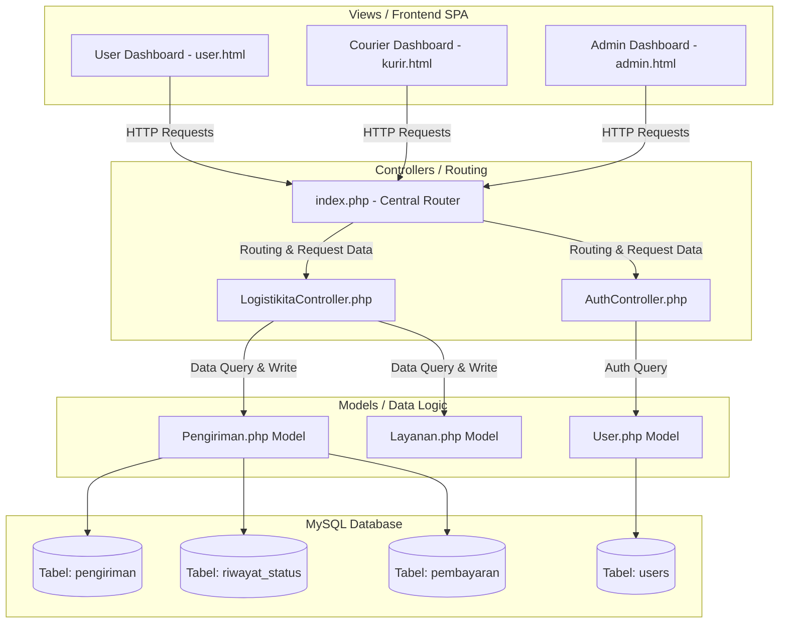
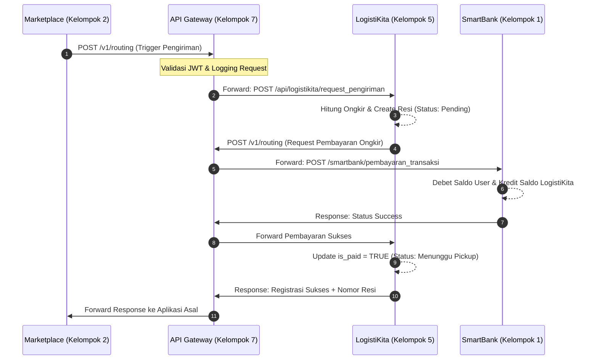

# DOKUMEN DESAIN REKAYASA PERANGKAT LUNAK: LOGISTIKITA (KELOMPOK 5)

Dokumen ini berisi kelanjutan dokumentasi teknis sistem LogistiKita yang mencakup Poin 2, 3, 4, dan 5 sesuai dengan kriteria penilaian tugas besar Rekayasa Perangkat Lunak 2.

---

# 2. Use Case / Fitur Utama

Bagian ini mengidentifikasi kebutuhan fungsional sistem LogistiKita berdasarkan skema ekosistem ekonomi digital terintegrasi. Fitur-fitur utama di bawah ini dirancang untuk mendefinisikan interaksi antara aktor manusia (User, Kurir, Admin) serta interaksi otomatis antar-sistem (Machine-to-Machine API).

## 2.1 Fitur 1: Request Pengiriman (`/logistikita/request_pengiriman`)
*   **Deskripsi Fungsional:** Fitur ini berfungsi untuk menerima dan meregistrasikan permintaan pengiriman paket baru ke dalam sistem. Fitur ini tidak berdiri sendiri, melainkan dipicu (*triggered*) secara otomatis saat ada transaksi belanja sukses dari aplikasi Marketplace atau pemesanan bahan baku di SupplierHub.
*   **Perilaku Sistem:** Sistem menerima data alamat asal, alamat tujuan, dimensi/berat paket, dan identitas pengirim. Sistem kemudian memvalidasi kelengkapan parameter, secara otomatis memicu generator nomor resi unik, dan mendaftarkan entitas pengiriman tersebut ke dalam basis data dengan status awal `pending` (menunggu konfirmasi pembayaran).

## 2.2 Fitur 2: Tracking Status (`/logistikita/tracking_status`)
*   **Deskripsi Fungsional:** Fitur ini memfasilitasi pelacakan pergerakan paket secara *real-time* dari hulu ke hilir.
*   **Perilaku Sistem:** Fitur ini memiliki dua antarmuka akses:
    1.  *Read Operation (GET):* Diakses oleh User/Pelanggan untuk melihat linimasa perjalanan paket mereka berdasarkan nomor resi.
    2.  *Write Operation (POST):* Diakses oleh Kurir melalui gawai lapangan atau Admin melalui konsol pusat untuk memperbarui koordinat posisi dan status paket (misal dari `pickup` -> `transit` -> `delivered`). Setiap pembaruan wajib disimpan ke dalam tabel sejarah log status (`riwayat_status`) untuk menjamin transparansi pelacakan.

## 2.3 Fitur 3: Biaya Pengiriman (`/logistikita/biaya_pengiriman`)
*   **Deskripsi Fungsional:** Fitur kalkulator ongkos kirim (ongkir) otomatis yang digunakan oleh sistem untuk menentukan tarif pengiriman sebelum transaksi disahkan.
*   **Perilaku Sistem:** Sistem menerima parameter jarak pengiriman (dalam kilometer) dan bobot fisik paket (dalam kilogram). Menggunakan formula tarif dasar logistik yang telah ditentukan, sistem secara dinamis menghasilkan rincian ongkir. Fitur ini juga mendukung asuransi tambahan untuk barang berharga tinggi guna meminimalisir risiko kehilangan barang fisik di jalan.

## 2.4 Fitur 4: Pembayaran Logistik (`/logistikita/pembayaran_logistik`)
*   **Deskripsi Fungsional:** Fitur integrasi pembayaran ongkir yang menghubungkan LogistiKita dengan otoritas keuangan pusat (*SmartBank*).
*   **Perilaku Sistem:** LogistiKita bertindak sebagai penagih (*biller*). Sistem akan membuat kode transaksi pembayaran logistik, lalu mengirimkan permintaan debit saldo (*payment request*) ke API SmartBank. Jika status respons dari SmartBank bernilai sukses, sistem LogistiKita akan memperbarui kolom status pembayaran (`is_paid = TRUE`) dan mengubah status paket secara otomatis menjadi `menunggu_pickup` agar dapat diambil oleh Kurir.

## 2.5 Fitur 5: Biaya Layanan Logistik (`/logistikita/biaya_layanan_logistik`)
*   **Deskripsi Fungsional:** Fitur akuntansi operasional yang bertugas memotong biaya layanan (fee) logistik sebesar **5% atau flat Rp 5.000** sesuai aturan ekonomi ekosistem.
*   **Perilaku Sistem:** Setiap kali terjadi transaksi pengiriman yang terbayar lunas, sistem akan menyisihkan 5% dari biaya pengapalan sebagai "biaya layanan logistik". Modul ini bertugas menghitung akumulasi total biaya layanan logistik secara periodik untuk dilaporkan pada dashboard keuangan Admin dan disetorkan sebagai *tax/fee* ekosistem ke SmartBank.

---

# 3. Diagram Arsitektur

Arsitektur aplikasi LogistiKita dibangun dengan mematuhi pola desain **Model-View-Controller (MVC) Native** yang terintegrasi secara *stateless* melalui *API Gateway / Integrator* menuju entitas luar (SmartBank, Marketplace, SupplierHub).

## 3.1 Blok Arsitektur Internal MVC

Pola komunikasi internal sistem LogistiKita dijabarkan dalam diagram blok berikut:



## 3.2 Diagram Integrasi Lintas-Sistem Ekosistem RPL

Diagram ini menunjukkan bagaimana LogistiKita berinteraksi dengan aplikasi kelompok lain melalui API Gateway:



---

# 4. Flow Proses (Input - Proses - Output)

Di bawah ini adalah penjelasan terperinci mengenai alur logika sistem (IPO) untuk masing-masing dari lima fitur utama LogistiKita:

### 4.1 IPO Fitur 1: Request Pengiriman
*   **Input:**
    *   `user_id` (Integer - ID pengirim barang)
    *   `penerima_nama` (String - Nama lengkap penerima)
    *   `penerima_telp` (String - Kontak penerima)
    *   `penerima_alamat` (Text - Alamat lengkap tujuan)
    *   `berat` (Float - Berat paket dalam satuan kg)
    *   `layanan` (String - Pilihan tipe layanan: "Reguler" / "Express")
    *   `biaya_ongkir` (Decimal - Ongkos kirim yang telah dihitung)
*   **Proses:**
    1.  Controller menangkap request POST dan melakukan validasi kelengkapan parameter input.
    2.  Model memicu fungsi generator alfanumerik untuk membuat nomor resi unik (contoh format: `LKT-[RANDOM_STRING]`).
    3.  Menyimpan entitas transaksi ke dalam tabel `pengiriman` dengan parameter `is_paid = FALSE` dan `status = 'pending'`.
*   **Output:**
    *   Objek JSON: `status: 'success'`, `message: 'Request pengiriman berhasil dibuat'`, dan payload data `resi` beserta rincian pengiriman.

### 4.2 IPO Fitur 2: Tracking Status
*   **Input:**
    *   `resi` (String - Nomor resi paket)
    *   `status` (String - Status baru: `menunggu_pickup` / `pickup` / `transit` / `delivery` / `delivered`)
    *   `lokasi` (String - Posisi checkpoint kurir, misal: "Admin HQ" atau "Kurir Hub Cawang")
    *   `keterangan` (String - Informasi tambahan, misal: "Kurir sedang menuju alamat penerima")
*   **Proses:**
    1.  Sistem melakukan pencarian data berdasarkan parameter `resi` di tabel `pengiriman`.
    2.  Jika ditemukan, sistem memperbarui nilai kolom `status` di tabel `pengiriman` sesuai input baru.
    3.  Sistem merekam entri log baru ke dalam tabel `riwayat_status` (mencatat `pengiriman_id`, `status`, `lokasi`, `keterangan`, dan stempel waktu `waktu_update`).
*   **Output:**
    *   Objek JSON: `status: 'success'`, `message: 'Status pengiriman berhasil diupdate'`.

### 4.3 IPO Fitur 3: Biaya Pengiriman
*   **Input:**
    *   `asal` (String - Alamat/Kota pengirim)
    *   `tujuan` (String - Alamat/Kota penerima)
    *   `berat` (Float - Bobot paket dalam kg)
    *   `layanan` (String - Jenis layanan ekspedisi)
    *   `asuransi` (Boolean - Pilihan asuransi tambahan)
    *   `nilai_barang` (Decimal - Nilai barang jika mengaktifkan asuransi)
*   **Proses:**
    1.  Sistem mengambil tarif dasar ekspedisi logistik (contoh: Rp 10.000 untuk Reguler, Rp 15.000 untuk Express).
    2.  Sistem mengalikan tarif dasar tersebut dengan pembulatan ke atas dari berat barang (`ceil(berat)`).
    3.  Jika parameter `asuransi` bernilai `true`, sistem menambahkan biaya premi sebesar 0.5% dari parameter `nilai_barang`.
    4.  Menghitung akumulasi akhir biaya logistik.
*   **Output:**
    *   Objek JSON berisi rincian: `asal`, `tujuan`, `berat`, `biaya_ongkir`, `asuransi`, dan `total_biaya`.

### 4.4 IPO Fitur 4: Pembayaran Logistik
*   **Input:**
    *   `pengiriman_id` (Integer - ID baris tabel pengiriman)
    *   `bank_ref` (String - Nomor referensi transaksi dari SmartBank)
    *   `amount` (Decimal - Jumlah uang yang sukses didebit)
*   **Proses:**
    1.  Menerima callback/notifikasi sukses dari gerbang SmartBank atas transaksi tagihan ongkir.
    2.  Sistem memperbarui kolom `is_paid = TRUE` dan mengubah `status` paket menjadi `menunggu_pickup` pada tabel `pengiriman`.
    3.  Memasukkan catatan transaksi sukses ke tabel `pembayaran` sebagai bukti rekonsiliasi keuangan.
    4.  Memicu catatan sejarah log awal ke tabel `riwayat_status` dengan keterangan "Pembayaran terkonfirmasi via SmartBank".
*   **Output:**
    *   Objek JSON: `status: 'success'`, `message: 'Status pembayaran dan pengiriman berhasil diperbarui'`.

### 4.5 IPO Fitur 5: Biaya Layanan Logistik
*   **Input:**
    *   Permintaan rekapitulasi data keuangan (pembacaan *flag* `is_paid = TRUE`).
*   **Proses:**
    1.  Sistem melakukan query agregasi database: `SELECT SUM(biaya_layanan) FROM pengiriman WHERE is_paid = TRUE`.
    2.  Menghitung nilai margin operasional kotor dikurangi potongan pajak sistem 5% yang disetorkan ke ekosistem.
*   **Output:**
    *   Objek JSON: `status: 'success'`, data `total_fee` (misal: "Rp 250.000").

---

# 5. API Endpoint

Bagian ini merupakan **kontrak sistem** yang menjadi acuan bagi kelompok lain saat berintegrasi dengan aplikasi LogistiKita melalui *API Gateway*.

## 5.1 POST `/logistikita/request_pengiriman`
*   **Fungsi:** Mendaftarkan order pengiriman fisik baru (dipicu oleh Marketplace/SupplierHub).
*   **Headers:** `Content-Type: application/json`
*   **Request Body (JSON):**
    ```json
    {
      "user_id": 3,
      "penerima_nama": "Rian Hidayat",
      "penerima_telp": "08123456789",
      "penerima_alamat": "Jl. Merdeka No. 45, Bandung",
      "berat": 2.5,
      "layanan": "Reguler",
      "biaya_ongkir": 25000
    }
    ```
*   **Response (JSON - 200 Success):**
    ```json
    {
      "status": "success",
      "message": "Request pengiriman berhasil dibuat.",
      "data": {
        "id": 12,
        "resi": "LKT-A8F9K2",
        "status": "pending",
        "is_paid": 0
      }
    }
    ```
*   **Response (JSON - 400 Bad Request):**
    ```json
    {
      "status": "error",
      "message": "Field penerima_alamat is required."
    }
    ```

## 5.2 POST `/logistikita/tracking_status`
*   **Fungsi:** Memperbarui status perjalanan kurir dan mencatat log checkpoint.
*   **Headers:** `Content-Type: application/json`
*   **Request Body (JSON):**
    ```json
    {
      "resi": "LKT-A8F9K2",
      "status": "transit",
      "lokasi": "Admin HQ Jakarta",
      "keterangan": "Paket telah diserahkan ke kurir ekspedisi"
    }
    ```
*   **Response (JSON - 200 Success):**
    ```json
    {
      "status": "success",
      "message": "Status pengiriman berhasil diupdate.",
      "data": {
        "resi": "LKT-A8F9K2",
        "status_baru": "transit"
      }
    }
    ```

## 5.3 GET `/logistikita/tracking_status?resi=...`
*   **Fungsi:** Mendapatkan log pelacakan barang untuk ditampilkan pada timeline user.
*   **Request Parameters:** Query String `?resi=LKT-A8F9K2`
*   **Response (JSON - 200 Success):**
    ```json
    {
      "status": "success",
      "message": "Data tracking ditemukan.",
      "data": {
        "resi": "LKT-A8F9K2",
        "status": "transit",
        "penerima_nama": "Rian Hidayat",
        "riwayat": [
          {
            "status": "pending",
            "lokasi": "Sistem",
            "waktu_update": "2026-05-19 01:10:00",
            "keterangan": "Menunggu konfirmasi pembayaran"
          },
          {
            "status": "transit",
            "lokasi": "Admin HQ Jakarta",
            "waktu_update": "2026-05-19 01:30:00",
            "keterangan": "Paket telah diserahkan ke kurir ekspedisi"
          }
        ]
      }
    }
    ```

## 5.4 POST `/logistikita/biaya_pengiriman`
*   **Fungsi:** Menghitung ongkos kirim secara instan sebelum melakukan order.
*   **Headers:** `Content-Type: application/json`
*   **Request Body (JSON):**
    ```json
    {
      "asal": "Jakarta",
      "tujuan": "Bandung",
      "berat": 3.2,
      "layanan": "Express",
      "asuransi": true,
      "nilai_barang": 500000
    }
    ```
*   **Response (JSON - 200 Success):**
    ```json
    {
      "status": "success",
      "message": "Biaya pengiriman berhasil dihitung.",
      "data": {
        "asal": "Jakarta",
        "tujuan": "Bandung",
        "berat": 3.2,
        "layanan": "Express",
        "biaya_ongkir": 48000,
        "asuransi": 2500,
        "total_biaya": 50500
      }
    }
    ```

## 5.5 GET `/logistikita/biaya_layanan_logistik`
*   **Fungsi:** Rekapitulasi pajak layanan 5% (untuk audit sistem keuangan).
*   **Response (JSON - 200 Success):**
    ```json
    {
      "status": "success",
      "message": "Total fee layanan logistik berhasil direkap.",
      "data": {
        "total_fee": 12500,
        "tax_rate": "5%"
      }
    }
    ```

## 5.6 GET `/logistikita/system_logs`
*   **Fungsi:** Mengambil aktivitas pengiriman real-time untuk ditampilkan pada API Gateway Monitor Admin.
*   **Response (JSON - 200 Success):**
    ```json
    {
      "status": "success",
      "message": "System logs retrieved",
      "data": [
        {
          "status": "transit",
          "lokasi": "Admin HQ Jakarta",
          "timestamp": "2026-05-19 01:30:00",
          "resi": "LKT-A8F9K2"
        },
        {
          "status": "pending",
          "lokasi": "Sistem",
          "timestamp": "2026-05-19 01:10:00",
          "resi": "LKT-A8F9K2"
        }
      ]
    }
    ```
