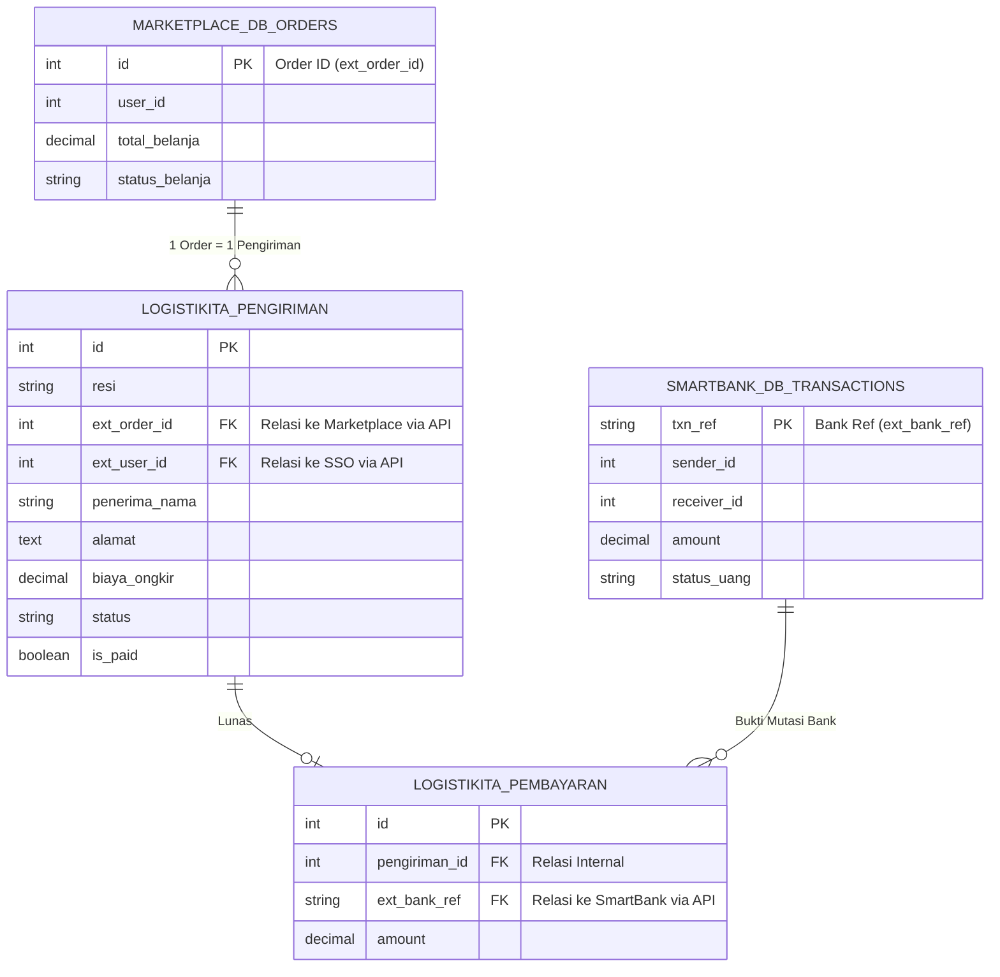

# SKEMA TABEL DATABASE (INTEGRASI LINTAS-APLIKASI)

Dalam sistem berbasis *Microservices* atau Ekosistem Terpadu seperti tugas besar RPL ini, aplikasi **LogistiKita (Kelompok 5)** tidak boleh menyimpan ulang seluruh data dari aplikasi lain agar tidak terjadi redudansi (data ganda). 

Oleh karena itu, kita menggunakan teknik **"Tabel Bayangan" (Shadow/Reference Columns)**. Artinya, *database* LogistiKita hanya menyimpan ID Referensi (*Foreign Key* eksternal) dari database kelompok lain, dan bukan menyimpan seluruh data mentahnya.

Berikut adalah gambaran relasi *database* LogistiKita dengan *database* aplikasi lain:

---

## 1. Tabel Inti LogistiKita & Kolom Bayangannya

### A. Tabel `pengiriman` (Tabel Transaksi Logistik Utama)
Tabel ini bertugas mencatat setiap paket yang harus dikirim. Tabel ini memiliki **dua kolom bayangan** yang mengikatnya dengan ekosistem luar.

| Nama Kolom | Tipe Data | Keterangan / Sumber Integrasi Eksternal |
| :--- | :--- | :--- |
| `id` | INT (PK) | Primary Key tabel LogistiKita. |
| `resi` | VARCHAR(20) | Nomor pelacakan unik *generate* sistem LogistiKita (Contoh: `LKT-88A9B2`). |
| **`ext_order_id`** | **INT (Shadow FK)** | **[KOLOM BAYANGAN]** Menyimpan `id` pesanan dari *Database Marketplace/SupplierHub*. Digunakan agar saat kurir mengklik "Delivered", LogistiKita tahu order nomor berapa di Marketplace yang harus di-*update* selesai. |
| **`ext_user_id`** | **INT (Shadow FK)** | **[KOLOM BAYANGAN]** Menyimpan `id` pengguna dari *Database Akun Pusat/SSO*. LogistiKita tidak punya tabel password pembeli, melainkan hanya merujuk ID ini. |
| `penerima_nama` | VARCHAR(100) | Nama orang yang menerima paket (dikirim dari API Gateway). |
| `penerima_alamat` | TEXT | Koordinat/Alamat tujuan fisik pengantaran. |
| `berat` | DECIMAL(5,2) | Berat paket dalam kilogram (kg) (dikirim dari API Gateway). |
| `biaya_ongkir` | DECIMAL(10,2)| Hasil perhitungan algoritma tarif LogistiKita (menjadi tagihan ke pembeli). |
| `biaya_layanan` | DECIMAL(10,2)| Potongan pajak 5% yang harus dibuang ke ekosistem (*Money Sink*). |
| `status` | ENUM | `pending`, `menunggu_pickup`, `transit`, `delivered`. |
| `is_paid` | BOOLEAN | `0` (Belum lunas) atau `1` (Sudah lunas di SmartBank). |

### B. Tabel `pembayaran` (Tabel Bukti Lunas)
Tabel ini adalah tabel rekonsiliasi yang membuktikan bahwa uang pelanggan benar-benar sudah dipotong oleh sistem bank (bukan sekadar uang bohong-bohongan).

| Nama Kolom | Tipe Data | Keterangan / Sumber Integrasi Eksternal |
| :--- | :--- | :--- |
| `id` | INT (PK) | Primary Key tabel pembayaran LogistiKita. |
| `pengiriman_id` | INT (FK) | Berelasi ke tabel `pengiriman` milik LogistiKita. |
| **`ext_bank_ref`** | **VARCHAR(50)** | **[KOLOM BAYANGAN]** Menyimpan Nomor Resi Transaksi (TXN) yang dilemparkan oleh *Database SmartBank (Kelompok 1)*. Ini adalah bukti sah bahwa uang telah terpotong. Jika terjadi masalah/dispute keuangan, ID ini digunakan untuk melacak ke server bank. |
| `amount` | DECIMAL(10,2)| Jumlah nominal uang sah yang masuk (*Biaya Ongkir*). |
| `created_at` | DATETIME | Waktu pelunasan ongkir dari gerbang bank. |

---

## 2. Visualisasi Relasi Database (Entity Relationship)

Berikut adalah diagram yang menunjukkan bagaimana **Tabel LogistiKita** berelasi silang lintas-server dengan **Tabel Kelompok Lain**. Garis putus-putus merah menandakan integrasi API lintas-aplikasi (*Cross-Database Foreign Key*).

---

## 3. Penjelasan Rinci Alur Kerja Antar-Tabel (*Data Flow*)

Diagram di atas tidak hanya sekadar gambar statis, tetapi menceritakan bagaimana data "berpindah" dan "mengunci" satu sama lain di antara ketiga server yang berbeda. Berikut adalah penjelasan sekuensial (langkah demi langkah) dari alur perpindahan data antar-tabel tersebut:

### Alur 1: Injeksi Pesanan Baru (`MARKETPLACE_DB_ORDERS` $\rightarrow$ `LOGISTIKITA_PENGIRIMAN`)
*   **Peristiwa:** Pembeli selesai melakukan *checkout* barang di aplikasi Marketplace.
*   **Data Flow:** Sistem Marketplace otomatis membuat baris baru di tabel `MARKETPLACE_DB_ORDERS` (misal mendapatkan `id = 99`).
*   Marketplace kemudian menembak API Gateway menuju LogistiKita, membawa variabel data alamat dan berat barang, **serta membawa `id = 99` tersebut**.
*   LogistiKita menerima lemparan API tersebut, lalu membuat baris baru di tabel `LOGISTIKITA_PENGIRIMAN` miliknya. LogistiKita akan menyimpan `99` tersebut ke dalam kolom **`ext_order_id`**.
*   **Hasil:** Mulai saat ini, tabel pengiriman LogistiKita sudah *terikat/ter-link* secara abadi dengan tabel pesanan Marketplace. Status di tabel LogistiKita saat ini adalah `status = pending` dan `is_paid = 0`.

### Alur 2: Eksekusi Keuangan (`LOGISTIKITA_PENGIRIMAN` $\rightarrow$ `SMARTBANK_DB_TRANSACTIONS`)
*   **Peristiwa:** Sistem LogistiKita telah selesai menghitung tarif ongkos kirim (misal Rp 20.000). Paket fisik belum bisa diambil oleh Kurir karena uangnya belum sah ditarik.
*   **Data Flow:** LogistiKita secara otomatis membaca total `biaya_ongkir` (Rp 20.000) dan identitas `ext_user_id` dari tabel pengirimannya sendiri. 
*   Berdasarkan data tersebut, LogistiKita mengirimkan perintah HTTP POST (Tagihan) ke *API SmartBank* untuk mendebet/memotong uang dari rekening pelanggan senilai Rp 20.000.
*   Server *SmartBank* merespons tagihan tersebut dengan memotong saldo asli milik pengguna dan mencatatnya ke dalam tabel mutasi rekening mereka: `SMARTBANK_DB_TRANSACTIONS`. Dari pencatatan ini, bank menerbitkan sebuah **Nomor Referensi Struk** (Misal: `txn_ref = TXN-BANK-123`).

### Alur 3: Rekonsiliasi & Pencatatan Lunas (`SMARTBANK_DB_TRANSACTIONS` $\rightarrow$ `LOGISTIKITA_PEMBAYARAN`)
*   **Peristiwa:** Uang dipastikan telah masuk ke rekening perusahaan LogistiKita.
*   **Data Flow:** Server *SmartBank* membalas (*return response*) API ke server LogistiKita dengan pesan *"Sukses Terpotong"* dan menyertakan kode referensi bank `TXN-BANK-123`.
*   LogistiKita menangkap balasan tersebut dan langsung membuat sebuah baris rekaman baru di tabel akuntansinya sendiri, yaitu `LOGISTIKITA_PEMBAYARAN`.
*   Di dalam tabel pembayaran tersebut, LogistiKita mengikat id pengiriman yang tadi dengan kode referensi bank eksternal tersebut ke dalam kolom **`ext_bank_ref`**.
*   **Hasil:** Tabel `LOGISTIKITA_PEMBAYARAN` kini berfungsi sebagai "Struk Digital" tak terbantahkan. Jika auditor menuduh LogistiKita memalsukan transaksi, Admin cukup melihat isi kolom `ext_bank_ref` dan mencocokannya dengan tabel milik server Bank pusat.

### Alur 4: Pelepasan Penugasan Kurir (Mutasi Akhir `LOGISTIKITA_PENGIRIMAN`)
*   **Peristiwa:** Berhubung tabel `LOGISTIKITA_PEMBAYARAN` sudah berhasil diisi (*insert success*), LogistiKita kini percaya diri bahwa uang benar-benar sudah aman.
*   **Data Flow:** LogistiKita melakukan *database update* pada tabel `LOGISTIKITA_PENGIRIMAN`.
*   Kolom bendera keuangan `is_paid` diubah nilainya menjadi **`1`** (TRUE).
*   Kolom `status` diubah secara mutlak dari `pending` menjadi **`menunggu_pickup`**.
*   **Hasil Akhir:** Karena status tabelnya telah bermutasi menjadi `menunggu_pickup`, barulah sistem LogistiKita memunculkan nomor resi tersebut di **Dashboard Kurir** layar depan. Kurir kini dapat memacu kendaraannya untuk mengambil barang secara fisik di dunia nyata.

---

## 4. Cara Menjelaskannya ke Klien/Dosen saat Presentasi

Jika dosen atau klien menanyakan bagaimana LogistiKita berintegrasi dengan data aplikasi lain padahal databasenya terpisah, jawablah seperti ini:

> *"Sistem kami dibangun berdasarkan kaidah integrasi basis data modern, di mana kami menerapkan konsep **Kolom Bayangan (Shadow References)**. LogistiKita memiliki integritas yang independen; kami tidak menduplikasi data barang atau sandi pengguna dari aplikasi Marketplace. Sebagai gantinya, tabel `pengiriman` kami hanya menyimpan* `ext_order_id` *(ID Pesanan Eksternal).* 
>
> *Hal yang sama berlaku untuk alur keuangan. Tabel `pembayaran` kami tidak memvalidasi kartu kredit secara langsung, melainkan menyimpan* `ext_bank_ref` *(Referensi Bank Eksternal). Ini berarti, jika suatu saat ada paket bernilai puluhan juta yang status pembayarannya dipertanyakan, LogistiKita tinggal melacak kode* `ext_bank_ref` *tersebut melalui API ke server SmartBank untuk memverifikasi keaslian uangnya secara mutlak."*
